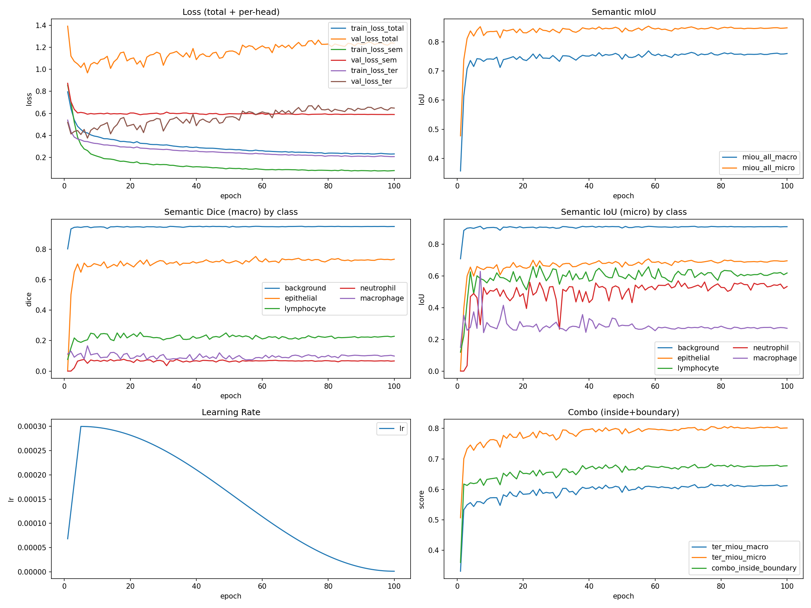

# MoNuSAC Nucleus Segmentation and Classification

[](https://huggingface.co/spaces/drneumann/CellClassification)
[](https://huggingface.co/drneumann/monusac-run9-segmentation)


Whole Slide Histopathology Inference with Deep Learning

**Author:** Deeter Neumann

# Project Overview
This project develops and deploys a deep learning pipeline for nucleus segmentation and cell type classification in H&E-stained histopathology images. The model is trained on the MoNuSAC dataset and performs inference on whole slide images (WSIs) using tiled processing and Gaussian blending.

The system demonstrates a full translational pipeline:
- Data preprocessing and normalization
- Multi-head segmentation (semantic and ternary (boundary))
- Whole slide tiling inference
- Interactive deployment via Hugging Face Spaces

# Live Demo:
https://huggingface.co/spaces/drneumann/CellClassification

# Objectives
- Segment nuclei in histopathology images
- Enable inference on large WSIs via tiling
- Provide an accessible web interface
- Demonstrate end-to-end ML deployment

# Cell Types Detected

Class
- Epithelial
- Lymphocyte
- Neutrophil
- Macrophage

# Model Architecture
- Backbone: ResNet Encoder (via segmentation_models_pytorch)
- Decoder: U-Net style
- Heads:
    - Semantic segmentation (5 classes (including background))
    - Ternary map (inside / boundary / background)

Why multi-head?
Boundary prediction improves instance separation and segmentation accuracy.

# Dataset
Training
- MoNuSAC 2020 - multi-organ nuclei segmentation dataset
- H&E stained histopathology
- 40x magnification
Evaluation / Demo
- MoNuSAC test WSIs

# Pipeline
1) Preprocessing
   - RGB conversion
   - ImageNet normalization
2) Whole Slide Inference
   - Tile size: 256x256
   - Overlap: 64 px
   - Gaussian blending to reduce edge artifacts
3) Post-processing
   - Argmax class prediction
   - Color overlay rendering
   - Interactive visualization

# Deployment
This project is deployed using:
- Docker
- Gradio UI
- Hugging Face Spaces

Hugging Face Spaces provides:
- Reproducible deployment
- Public accessibility
- Model hosting

# Model Weights

The trained model checkpoint is hosted separately on the Hugging Face Hub to keep the deployment lightweight:

https://huggingface.co/drneumann/monusac-run9-segmentation

The Gradio application downloads the checkpoint at runtime on first launch.

# Running Locally

1) clone repo  
`git clone https://github.com/DeeterNeumann/dl_seg_class_project.git`  
`cd dl_seg_class_project/deployment/space`

2) Install dependencies  
`pip install -r requirements.txt`

4) Run app  
`python app.py`

Open: http://localhost:7860

# Docker Deployment  
```
cd deploy  
docker build -t cell-seg .  
docker run -p 7860:7860 cell-seg
```

# Example Workflow
1) Upload H&E image
2) Model tiles and processes image
3) Semantic overlay shows cell types
4) Ternary overlay shows nucleus boundaries

# Training Dynamics


# Qualitative Results

The model jointly predicts semantic nucleus class (5-class) and ternary structure (background / inside / boundary).


# Training Summary and Observations
[Training run summary (PDF)](assets/reports/training_run_summary.pdf)

# Results

## Final Validation Performance (Best Checkpoint)

| Task | Metric | Value |
|------|--------|------:|
| Semantic (5-class) | mIoU (macro) | 0.756 |
| Semantic (5-class) | mIoU (micro) | 0.856 |
| Ternary | Dice (inside, macro) | 0.673 |
| Ternary | Dice (boundary, macro) | 0.608 |
| Ternary | Combo (inside + boundary) | 0.682 |
| Ternary | mIoU (micro) | 0.801 |

# Limitations
- Trained on MoNuSAC -> domain shift on other tissues
- No stain normalization
- CPU inference on Spaces limits WSI size
- Instance segmentation not fully implemented

# Future Work
- GPU deployment for faster WSI inference
- Stain normalization
- Instance segmentation via watershed or HoVer-Net approach
- Quantitative TIL scoring

# Repository Structure
```
dl_seg_class_project/
├── README.md                         # Project overview and documentation
│
├── training/                         # Model training pipeline
│   ├── dh_train_immbst_terwt.py      # Multi-head training (semantic + ternary)
│   └── scripts/
│       └── export_manifest_dataset.py  # Dataset manifest + preprocessing utilities
│
├── deployment/                       # Gradio application for inference
│   └── deploy/
│       ├── app.py                    # Gradio UI + runtime weight download
│       ├── model.py                  # Model architecture + load_model()
│       ├── inference.py              # Tiled inference + overlay utilities
│       ├── requirements.txt          # Space dependencies
│       ├── Dockerfile                # HF Space container configuration
│       └── weights/                  # Runtime-downloaded model checkpoint
│
├── assets/                           # Static project artifacts
│   ├── class_weights.json            # Semantic class weighting (training)
│   ├── examples/                     # Example images (downloaded by Space)
│   ├── figures/                      # Training dashboards and plots
│   └── reports/
│       └── training_run_summary.pdf  # Final capstone report
│
└── download_from_lightning.sh        # Utility for pulling checkpoints from Lightning
```
   
